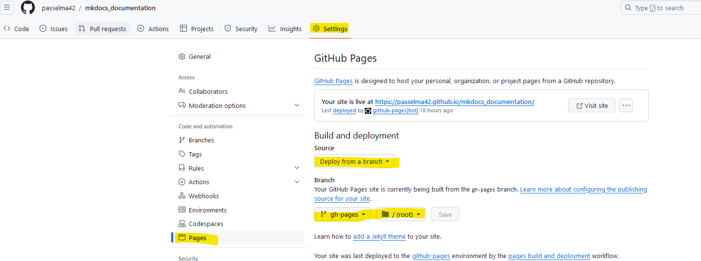

# Welcome to MkDocs

For full documentation visit [mkdocs.org](https://www.mkdocs.org).

## Commands

* `mkdocs new [dir-name]` - Create a new project.
* `mkdocs serve` - Start the live-reloading docs server.
* `mkdocs build` - Build the documentation site.
* `mkdocs -h` - Print help message and exit.

## Project layout

    mkdocs.yml    # The configuration file.
    docs/
        index.md  # The documentation homepage.
        ...       # Other markdown pages, images and other files.

## Publish with Actions

		.github/workflows	# Create folders
		ci.yml						# Create file for automated actions in Github

```yml title="ci.yml"
name: ci
on:
  push:
    branches:
      - master
      - main
permissions:
  contents: write
jobs:
  deploy:
    runs-on: ubuntu-latest
    steps:
      - uses: actions/checkout@v3
      - uses: actions/setup-python@v4
        with:
          python-version: 3.x
      - uses: actions/cache@v2
        with:
          key: ${{ github.ref }}
          path: .cache
      - run: pip install mkdocs-material
      - run: pip install pillow cairosvg
      - run: mkdocs gh-deploy --force
```
### Add to GitHub pages
* Go to settings
* Adjust accordingly


Now your ci.yml file should be deploid

## Publish/deploy without Actions
In Github enterprize **Actions** is not allowed (at least @UGent). You need to deploy manually.
Full documentation is found [here](https://www.mkdocs.org/user-guide/deploying-your-docs/).

### The short of it
Consider this project layout

    mkdocs.yml    # The configuration file.
    docs/
        index.md  # The documentation homepage.
        ...       # Other markdown pages, images and other files.

Issue following command in the project directory
```shell
mkdocs gh-deploy --remote-branch main
```

!!! Danger
		This will create and push the /sites directory to your main branch.
		If you are also working with Github desktop, don't commit and push otherwise you overwrite
		the gh-deploy command. When making changes to your local repository you need to reissue the deploy command.
		